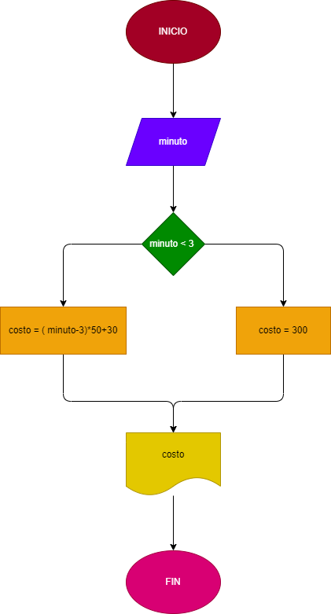

# Programa para saber el costo de una llamada 

Ingresar el tiempo de duracion de una llamada telefonica y determinar la cantidad a pagar, de acuerdo con lo siguiente:
a) Toda llamada que dure tres minutos o menos tiene un costo de 300$
b) Cada minuto adicional cuesta 50$

## Diagrama de flujo 

